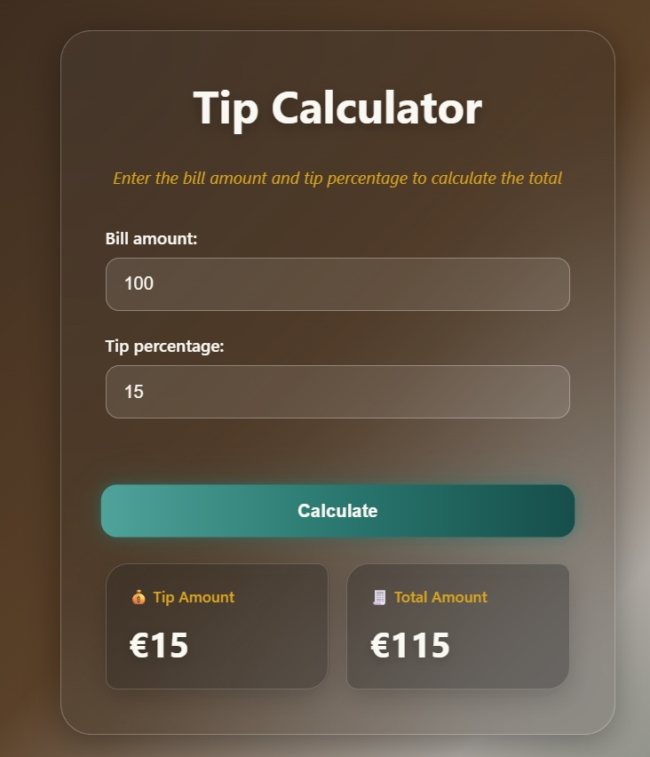
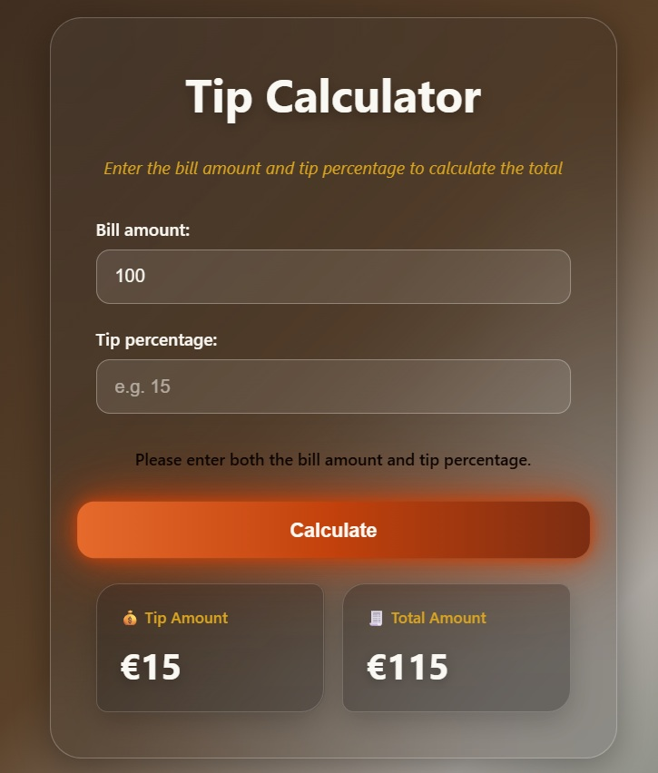
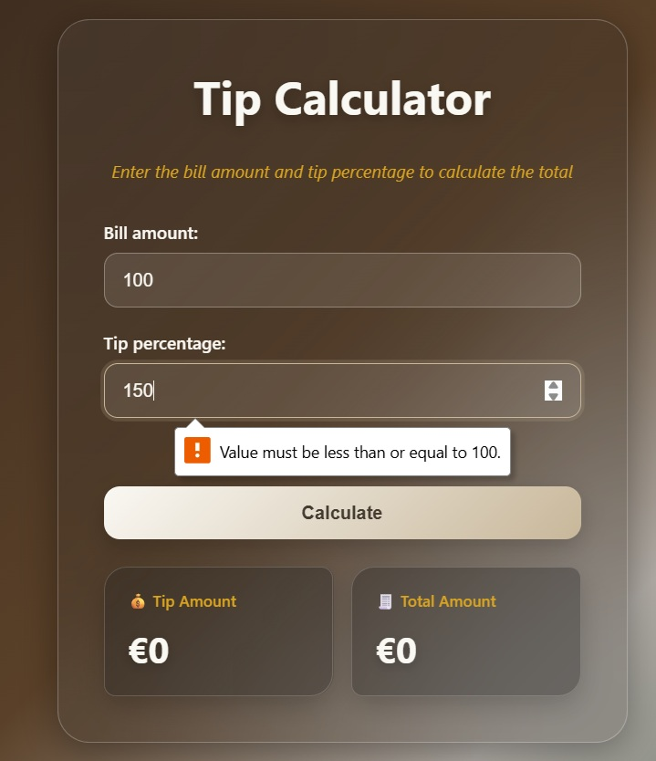

# 🧮 Tip Calculator

A simple and modern **Tip Calculator** built with **HTML, CSS, and JavaScript**.

This project was created as part of my **100 JavaScript Projects** learning journey to practice JavaScript fundamentals, DOM manipulation, user input, and event handling.

---

## 📸 Preview

## 📸 Preview

<p align="center">
  
  
  
</p>
---

## ✨ Features

- 💰 Enter the bill amount
- 👥 Enter the number of people
- 💵 Calculate the tip amount
- 🧮 Calculate the total amount
- 👤 Calculate the amount per person
- ⚡ Instant calculation using JavaScript
- 📱 Responsive and modern user interface
- 🎨 Glassmorphism-inspired design

---

## 🛠️ Technologies

- **HTML5** — Structure of the application
- **CSS3** — Styling, layout, animations, and responsive design
- **JavaScript (ES6+)** — Application logic and DOM manipulation

---

## 📚 JavaScript Concepts Practiced

This project helped me practice several important JavaScript concepts:

- Variables
- Constants
- Functions
- DOM manipulation
- `querySelector()`
- Event listeners
- User input
- `input` events
- Number conversion
- Arithmetic operations
- Conditional logic
- Updating HTML content dynamically
- Template literals
- Basic input validation

---

## 🧠 How It Works

The user enters:

1. **Bill Amount**
2. **Tip Percentage**
3. **Number of People**

JavaScript then calculates:

### Tip Amount

```text
Tip = Bill × Tip Percentage
